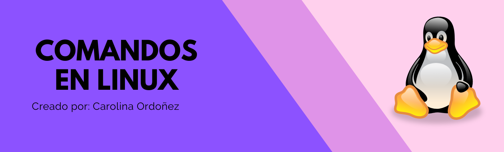

# Aqui veremos los comandos mas utilizados en Linux



- cd 

El comando cd es el encargado de cambiar de directorio, es decir va a la carpeta que necesitas

```bash
cd nombre_carpeta
ejemplo: cd Escritorio
```

Este comando hace que vayas al directorio actual

```bash
cd .
```

Este comando hace que vayas al directorio anterior

```bash
cd ..
```


- clear

El comando clear es el elcargado de limpiar la terminal.


- cp

El comando cp es el encargado de copiar archivos y directorios


```bash
cp nombre_archivo nombre_copia
ejemplo: cp archivo.txt copia
```

- cat

El comando cat es una concatenacion y se encarga de leer los datos de un archivo 

```bash
cat nombre_archivo
ejemplo: cat archivo.txt
```

- ls

El comando ls es el encargado de listar el contenido del directorio o carpeta en el que se esta

```bash
ls
```

lista todo el contenido del directorio o carpeta en el que se esta, incluyendo los archivos ocultos

```bash
ls -a
```

lista todo el contenido del directorio o carpeta en el que se esta, incluyendo informacion como: usuario, permisos, tamaño, fecha y hora de creacion 

```bash
ls -l
```

lista todo el contenido ademas de los archivos ocualtos del directorio o carpeta en el que se esta, incluyendo informacion como: usuario, permisos, tamaño, fecha y hora de creacion 

```bash
ls -la
```


- man

El comando man es el encargado de mostrar el manual del comando que se este indicando.

```bash
man nombre_comando
ejemplo: man ls
```

- mkdir

Con el comando mkdir se pueden crear carpetas o subdirectorios

```bash
mkdir nombre_carpeta
ejemplo: mkdir carpeta_1
```

- mv

Con el comando mv puedes mover o cambiar el nombre de los archivos y directorios

```bash
cp nombre_archivo nombre_mover
ejemplo: cp archivo.txt carpeta_nueva
```


- nano

El comando nano es el encargado de abrir un editor de texto con el archivo indicado

```bash
nano nombre_archivo
ejemplo: nano archivo.txt
```


- pwd

El comando pwd es el encargado de imprimir la carpeta o directorio en el cual se esta trabajando

```bash
pwd
```

- rm

El comando rm es el encargado de eliminar archivos

```bash
rm archivo_eliminar
ejemplo: rm copia
```

Para eliminar un directorio se tiene que usar rf


```bash
rm -rf directorio
ejemplo: rm -rf carpeta_eliminar
```

- touch

El comando touch se utiliza para crear archivos.

```bash
touch nombre_archivo
ejemplo: touch archivo.txt
```


