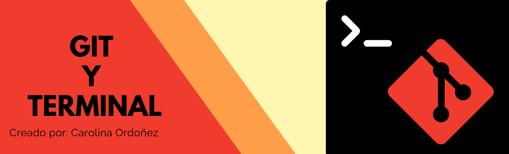

# Aqui veremos los comandos mas utilizados en Git y Linux 

### Alguno de los comando utilizados en Git los podemos ver en el siguiente link
 

Aqui [Linux](./LINUX.md) 
 
los comandos en git son utilizados

  

### Alguno de los comando utilizados en Linux los podemos ver en el siguiente link
 

Aqui puede ver la informacion [Git](./GIT.md) 

 
los comandos en linux son utilizados para darnos informacion de la rama actual
